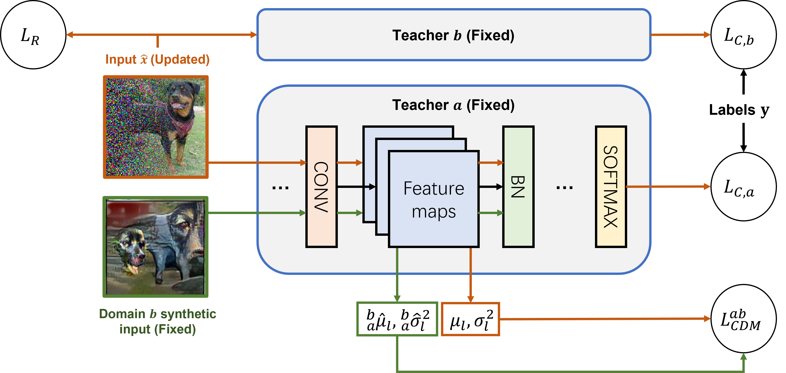
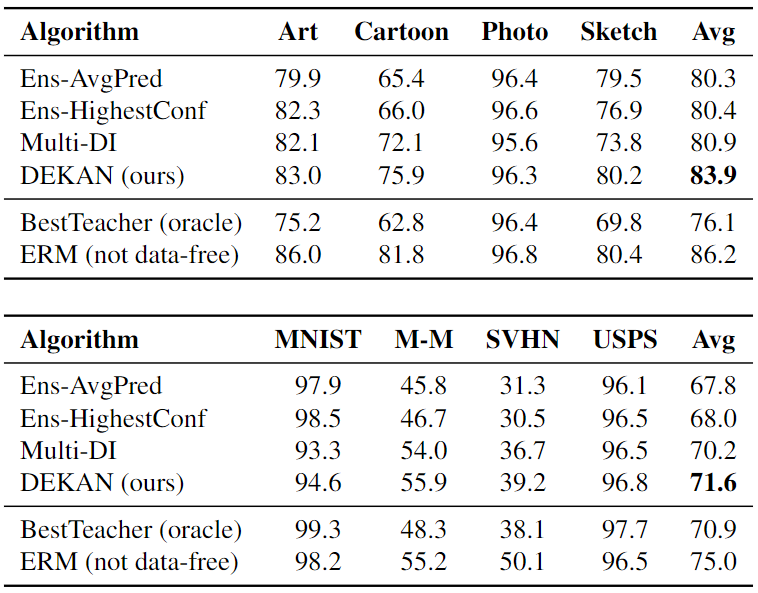

# Towards Data-Free Domain Generalization



This repo contains code for our paper:

> [**Towards Data-Free Domain Generalization**](https://arxiv.org/pdf/2110.04545.pdf)<br>
> [Ahmed Frikha](https://scholar.google.de/citations?user=NiarLswAAAAJ&hl=en)\*, [Haokun Chen](https://scholar.google.com/citations?user=ilbqzDwAAAAJ&hl=en)\*, [Denis Krompass](https://www.dbs.ifi.lmu.de/~krompass/), [Volker Tresp](https://www.dbs.ifi.lmu.de/~tresp/)<br>
> LMU, Siemens<br>
> ACML 2022

### Getting Started
Download the pretrained teacher models:
```sh
python ./datasets/teacher_download.py --root_dir=%TEACHER_DIR
```

Download the datasets:
```sh
python ./datasets/dataset_download.py --dataset=%DATASET --data_dir=%DATASET_DIR
```

Prepare the intra-domain synthetic images:
```sh
python ray_imgs.py --dataset=%DATASET --log_snapdir=%LOG_DIR --dataset_dir=%DATASET_DIR --teacher_snapdir=%TEACHER_DIR --stage=1
```

Prepare the cross-domain synthetic images:
```sh
python ray_imgs.py --dataset=%DATASET --log_snapdir=%LOG_DIR --dataset_dir=%DATASET_DIR --stage1_snapdir=%STAGE1_DIR --teacher_snapdir=%TEACHER_DIR --stage=2
```

Training a generalized student via knowledge distillation:
```sh
python ray_student.py --dataset=%DATASET --log_snapdir=%LOG_DIR --dataset_dir=%DATASET_DIR --stage1_snapdir=%STAGE1_DIR  --stage2_snapdir=%STAGE2_DIR--teacher_snapdir=%TEACHER_DIR --image_snapdir=%IMAGE_DIR
```

### Results
